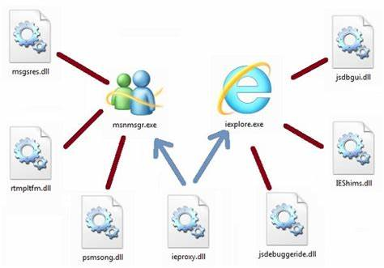
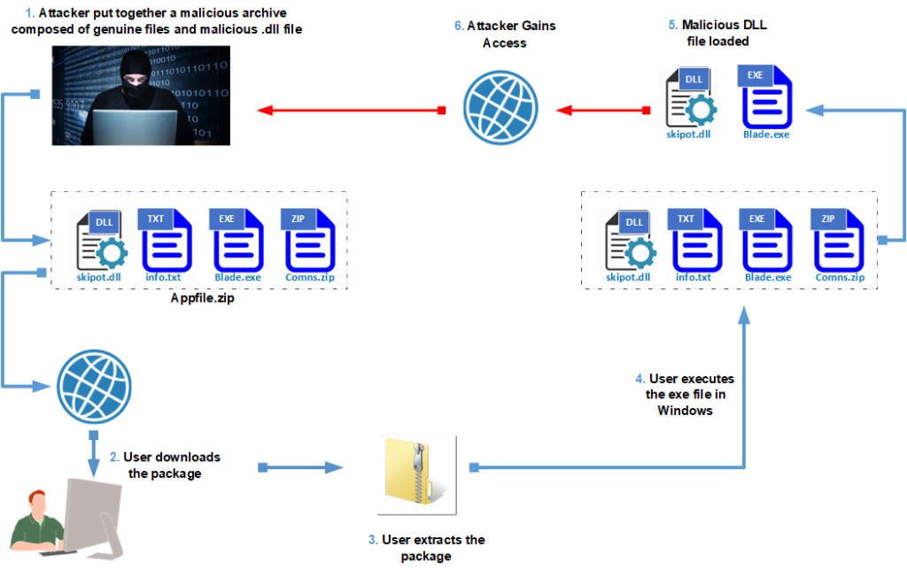
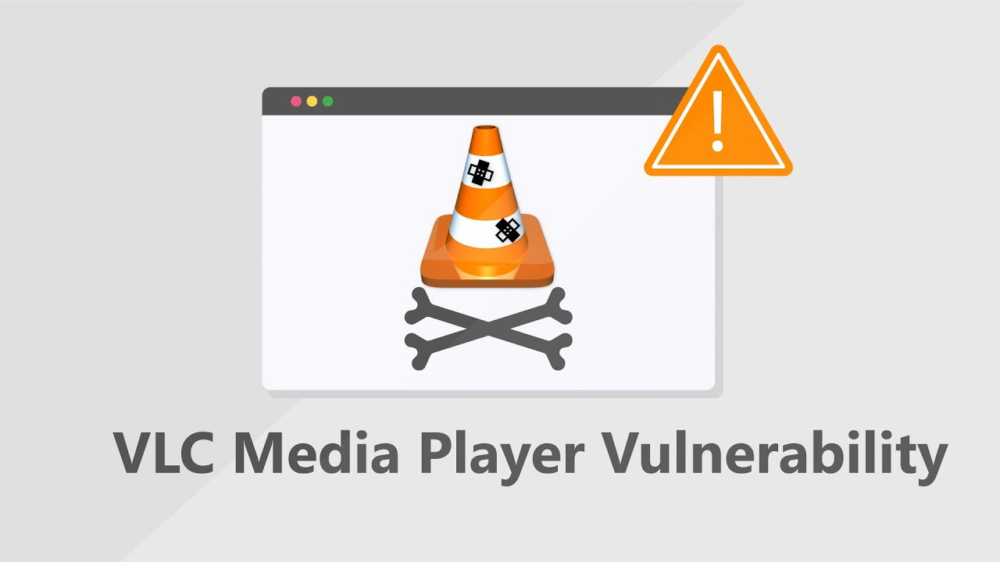

# DLL Injection and CVE-2010-3124
____

## Overview :seedling:
This project explores the topic of DLL (Dynamic Link Library) injection and specifically   
focuses on the CVE-2010-3124. 

_CVE-2010-3124_ refers to an untrusted search path vulnerability found in VLC Media Player   
version 1.1.3 and earlier.  

Here are key points that can help you have a better overview about this project: 
- **Vulnerability**: The issue arises due to an insecure search path used by  
VLC Media Player when loading dynamic link libraries (DLLs).
- **Attack Scenario**: An attacker places a malicious Trojan horse wintab32.dll in the   
same folder as an innocent-looking .mp3 file.
- **Exploitation** : When VLC Media Player attempts to load the .mp3 file, it accidentially   
loads the malicious DLL, allowing the attacker to execute arbitrary code.
- **Impact**: Successful exploitation can lead to arbitrary code execution and potentially   
allow an attacker to take control of the affected system.

**Attention** :warning: :warning: :warning:

> Feel free to explore our code, documentation, and any additional resources within this   
>repository. Remember to use this knowledge responsibly and ethically. Happy hacking!  
>🚀🔍🔐
> 

## What are DLL injection and CVE-2010-3124? :file_folder:

### **DLL**
DLL stands for Dynamic Link Library and DLL files are modules that contain functions  
and data that can be used by other programs or DLLs. DLL files allow programs to share common   
functionality and reduce memory usage. They also enable programs to interact with the Windows   
operating system and its components.  

### **DLL Injection** 
DLL injection is a technique used to run code within the address space of another process by  
forcing it to load a malicious dynamic-link library (DLL). In a DLL injection attack, the attacker exploits vulnerabilities in a target process to inject malicious DLLs. Once successfully injected, the malicious DLL can perform a variety of malicious actions, such as stealing sensitive information, modifying the behavior of the application, or facilitating further attacks.  

### **CVE-2010-3124** 
Untrusted search path vulnerability in `bin/winvlc.c` in VLC Media Player *1.1.3* and earlier allows local users, and possibly remote attackers, to execute arbitrary code and conduct DLL hijacking attacks via a Trojan horse wintab32.dll that is located in the same folder as a .mp3 file. You can see more about this CVE [here](https://cve.mitre.org/cgi-bin/cvename.cgi?name=CVE-2010-3124#:~:text=Description%20Untrusted%20search%20path%20vulnerability%20in%20bin%2Fwinvlc.c%20in,located%20in%20the%20same%20folder%20as%20a.mp3%20file.).  
